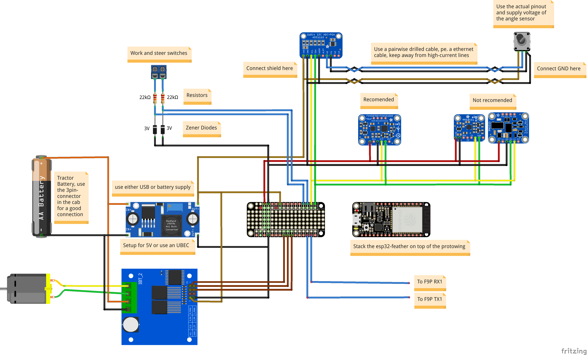

# esp32-aog
Software to control the tractor from AgOpenGPS. Can also be used as an NTRIP-client and GPS to TCP, Serial or UDP bridge.

# Features
* complete rewrite of the software for the physical part of AgOpenGPS. Uses a multi-threaded aproach with clear ownership of data and almost no public
  accessible variables. Tries to use other libraries as much as possible and is clearly structured with meaningful names.
* Cool and confortable WebUI, creates automaticaly a hotspot on first start, a Wifi to connect to can be configured in the WebUI
* Everything is configured from the WebUI, no conditional compiling and changing of the source code needed. Sane defaults are used: everything has to
  be activated to work, like PWM-drivers or IMUs
* Settings are stored into flash on user request. New features normaly require an apply&reboot cycle to activate, the WebUI clearly shows this.
* Status and values like uptime, processor load, roll/pitch/heading etc are actualised in realtime in the WebUI
* CAN-bus/J1939-connection possible, so the workswitch can be configured to react on PTO or motor RPMs or hitch positions
* The autosteer-button is automaticaly recognised as a switch, if held longer than a configurable time
* The wheel angle sensor can be configured as an input of the ESP32 or via ADS1115 to enable differential measurement (recomended)
* A new mode for the wheel angle sensor is introduced, to calculate out the unlinearities if connected with two arms to the tie rod
* A complete new PID-controller is implemented
* The combo FXAS2100/FXOS8700 for the IMU is recomended, as it is much more precise. An euler angle can be configured to account for mounting
  errors like mounting on a slanted bonnet.
* calibration of the FXAS2100/FXOS8700 can be done over serial link and with the [MotionCal App by PJRC](https://www.pjrc.com/store/prop_shield.html).
  After calibration, hit "Send Cal" in MotionCal and "Apply" in the WebUI to save the values into the flash.
* MMA8451 and BNO055 work too, but especialy the BNO055 is not recomended due to the noisy data and repeated calibration after every restart or if moved too much.
* All analog measurements are digitaly low-pass filtered (2. order butterworth or similar), this removes a lot of noise.
* All operations for the IMU are done in quaternions, so no gimbal lock is possible and is generally more performant if somewhat more complicated to understand.
* A complete NTRIP-client is implemented, a fixed or dynamic position can be sent back by a configurable intervall.
* The GPS-data can be sent to either UDP, USB (Serial) ot the second physical serial port of the ESP32.
* A TCP-socket provides a direct link to the GPS-Receiver. It is possible to configure the receiver on the go (pe. the F9P with u-center).
  Also the data can be used by 3rd-party software which expects the NMEA-stream on a TCP-connection.

# Caveats
* As this software is fearly new, not so much testing is done. If you find bug, please open an issue on github.
* **As the WebUI is quite taxing on the Websocket implementation; the ESP32 can crash without warning if left too long connected. Without open connection to a browser,
  no such crashes are documented. On my hardware, a longtime stresstest of more the five days of uptime was completed successfully, if the tab with
  the WebUI is closed after using it.** The cause of the crashes is in the implementation of the used TCP-stack/Websocket-API. Not much can be done about it,
  as it is the default implementation which comes with framework (ESPAsyncWebServer), is really fast/performant and is used by the library to generate the WebUI.
* No configuration is done in AgOpenGPS, everything is configured in the WebUI. Technical explanation: some of the settings in AgOpenGPS have the
  wrong range (like the counts per degree or center of the wheel angle sensor if connected by ADS1115), or are used for different things (like the
  D-part of the PID controller is used in newer versions for sidehill draft compensation). General rule: if it is configurable in the WebUI, the value in AgOpenGPS
  doesn't matter.

# Schematics

The configuration has to match the connections for the IBT2 (PWM, enable) and the work and steer switches. This schematics is with modules from adafruit, but you
can use other brands when you adjust the firmware for it. This is usualy done by changing the `board` in `platformio.ini`. 

An example of a itemlist is below:

Amount | Id | Supplier | Description
--- | ---- | -------- | ----------------------------------------------------------------------------
1x  | 3405 | Adafruit | HUZZAH32 – ESP32 Feather Board (with headers)
1x  | 2884 | Adafruit | FeatherWing Proto - Prototyping Add-on For All Feather Boards
1x  | 2886 | Adafruit | Header Kit for Feather - 12-pin and 16-pin Female Header Set
1x  | 3463 | Adafruit | Precision NXP 9-DOF Breakout Board - FXOS8700 + FXAS21002
1x  | 1085 | Adafruit | ADS1115 16-Bit ADC - 4 Channel with Programmable Gain Amplifier
1x  | 1385 | Adafruit | UBEC DC/DC Step-Down (Buck) Converter - 5V @ 3A output
1x  |      | Various  | Some wires in different colors to connect the parts
1x  |      | Various  | IBT-2; BTS7960 based motor driver
1x  |      | Various  | Rotary Angle Sensor, preferably hall effect and with 12V supply
1x  |      | Ardusimple | simpleRTK2B (ZED-F9P L1+L2 GNSS module)

## Alternations:
* Use other modules, as long as the chips on it are the same.
* Instead of the UBEC, you can use another way to convert 12V -> 5V.
* You can split this into two units: the motor controller and the GPS/IMU stuff.
* You can solder the wires directly to the esp32 feather, but with the protoboard you can take it away for programming or replacing it.

> Please consider buying quality components by genuine resellers to support the development of new cool stuff.

# Installation

## Warning before you start
Read this file through, before starting to half-ass it. It is not so hard to get a working system, just give it enough time and install it in this order.
Some packets take a real long time to install with no visible progress. Just wait until finished.

## Install Prerequisites
1. install atom: https://atom.io/
1. inside atom:
   1. click on "install a package"
   1. search for "platformio-ide" and install it
   1. install clang as desribed on the website
   1. it's taking forever, so please be patient
   1. restart as asked
   1. open the platformio home tab (if not opened automaticaly, use the menu)
      1. go to "Platforms" (left side tile)
      1. choose the "Embedded" tab
      1. install the "Esspressiv 32" platform
1. install git: https://git-scm.com/downloads
   1. use the defaults in the setup, define atom as the default editor
1. install all needed drivers for your platform. This is usualy done by installing the CP210x-driver, but consult the documentation of the manufacturer of your esp32. 

## Downloading the repository
1. open a folder in the explorer, preferably not too deep inside the drive. `C:\` or a folder under it should work
1. right click on it and choose "Git Bash Here"
1. enter `git clone https://github.com/eringerli/esp32-aog.git`
1. enter `cd esp32-aog`
1. enter `git submodule init`
1. enter `git submodule update`

## Compiling
1. open the created folder above from the platformio home
1. click build (the tile with the tick), the missing dependencies should be installed automaticaly

## Upload to the ESP32
1. connect the ESP32 over USB
1. click on upload (the tile with the arrow)

## Configuration

All configuration is done in the WebUI. To connect to the created hotspot of the esp32, using a mobile device is normaly the simplest solution.

To get the IP-adress of the esp32, go to your wifi-settings and look for the gateway-address or use a portscanner. Alternatively, connect the ESP32 to the USB and open a monitor on it. It should print the SSID/IP address. 

After login in to the WebUI, you can then change the wifi to whatever you like. The esp32 tries to login, and if that fails, makes a new hotspot with the given ssid/password. 

**The configuration is saved as long as there is no complete clearing of the flash of the esp32.** To  reset to the defaults, you either press the button in the WebUi or erase the flash of the esp32 with platformio/your editor. A new upload of the firmware doesn't affect the saved settings. 
## Updating the repository
As there are sometimes new repositories/submodules added, enter the following to update:
1. go to the esp32-aog repository and open a git bash-terminal
1. `git pull`
1. `git submodule sync`
1. `git submodule init`
1. `git submodule update`

Repeat them as needed.
